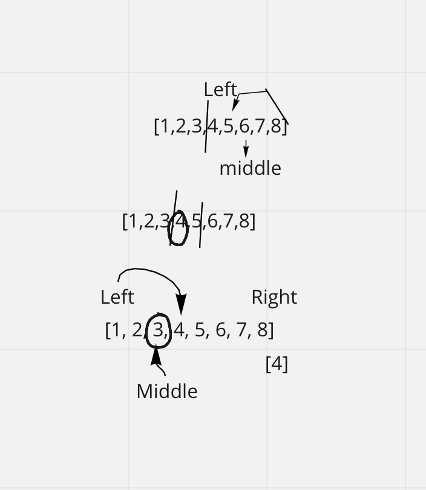

# Array-Binary-Search
Write a function called BinarySearch which takes in 2 parameters: a sorted array and the search key. Without utilizing any of the built-in methods available to your language, return the index of the array’s element that is equal to the value of the search key, or -1 if the element is not in the array.

## Example 
Input -
[4, 8, 15, 16, 23, 42], 15
[-131, -82, 0, 27, 42, 68, 179], 42
[11, 22, 33, 44, 55, 66, 77], 90
[1, 2, 3, 5, 6, 7], 42

Output -[2]  [4]  [-1]  [-1]

## Algorithm
-   create an left index of 0 and right index that points at the end of the array.
- loop through the array and make sure the left and right index are not equal
- calculate the middle index 
- if the value in the array at the mid index is the search key, return the mid index
- if the mid value is greater than the search key, adjust the left and right to lower half of the array. 
- Once finished and there is not a match, return -1

## Psuedocode
> const arrayBinarySearch = (arr,key) => {
> left = 0, right = arr.length - 1
> while (left <= right) let mid = calculateMid()
> if(arr[mid] === key)return mid
> else if (arr[mid] < key) left = mid + 1 else right = mid -1

## Whiteboard process
