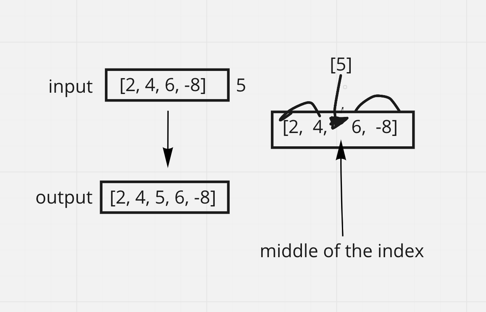

# Array Insert Shift
- Write a function called `insertShiftArray` which takes in an array and a value to be added. Without utilizing any of the built-in methods available to your language, return an array with the new value added at the middle index

## Example
- input -> [2,4,6,-8], 5 [42,8,15,23,42], 16
- output -> [2,4,5,6,-8] [42,8,15,16,23,42]

## Algorithm
- By figuring out the length of the array, we can figure out what the middle index should be and push that new value into the array at that index.
    1. create a new empty array
    2. determine what the middle is in the array
    3. literate through the array
    4. use if statement to determine if [i] is at the middle of the index
    5. if so, push the new value into the new array

## Pseudocode
>function insertShiftArray takes in array;
>
>declare insertedArray = [];
>
>declare start <- 0;
>
>declare end <- length of array - 1;
>
>while start <= end
> declare insertValue
>
> declare middleValue
>
> array[current] != middleIndex ? insertedArray push insertValue : insertedArray push arr[current];

## Whiteboard Process
