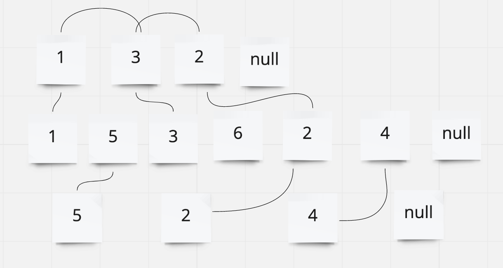

# Linked List

 ## Problem Domain
 - Create a Linked List. The class should contain an insert method (which adds a new node to the head of the linked list), an includes method (which indicates whether a value exists within the linked list), a toString method (which returns a string representing the values in the linked list), an append method (which adds a new node with the given value to the end of the list), an insert before method (which adds a new node with the given new value immediately before the first node that has the value specified), an insert after method (which adds a new node with the given new value immediately after the first node that has the value specified), a kth from end method(which returns the k-th value from the end of a linked list)

 ## Methods
- Kth From End Method
- Input: kth value Output: node value at kth from end position
- set current to equal head
- declare a variable to count the length of the linked list
- declare an empty array
### Kth
- traverse through linked list increasing the count variable with each loop until node. next == null and pushing values into an array.
- length return array[(length-1) - K];
### Zip
- Set variables string to an empty string and i to 0. Used a while loop goes until both current nodes are null. When i is even, add node from link1 and when odd, add node from link 2. at the end of the loop add 1 to i. O(n)
## UML 

