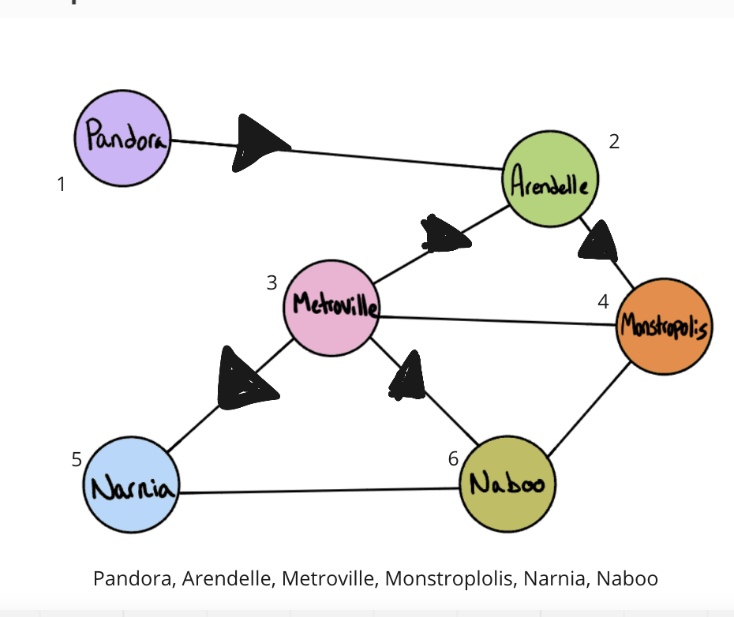

# Graph Breadth First

## Problem Domain
- Implement a breadth-first traversal on a graph.
- Write the following method for the Graph class:

- breadth first
- Arguments: Node
- Return: A collection of nodes in the order they were visited.
- Display the collection

## Algorithm
 - Initalize a current vertex, queue array, and visited array.
 - Begin with queue with the vertex and pass it into a function. 
 - Leave the Queue into current index
 - Shift the current edges back into the queue
 - Validate if current is in visited and if not push it into it.

## UML 

