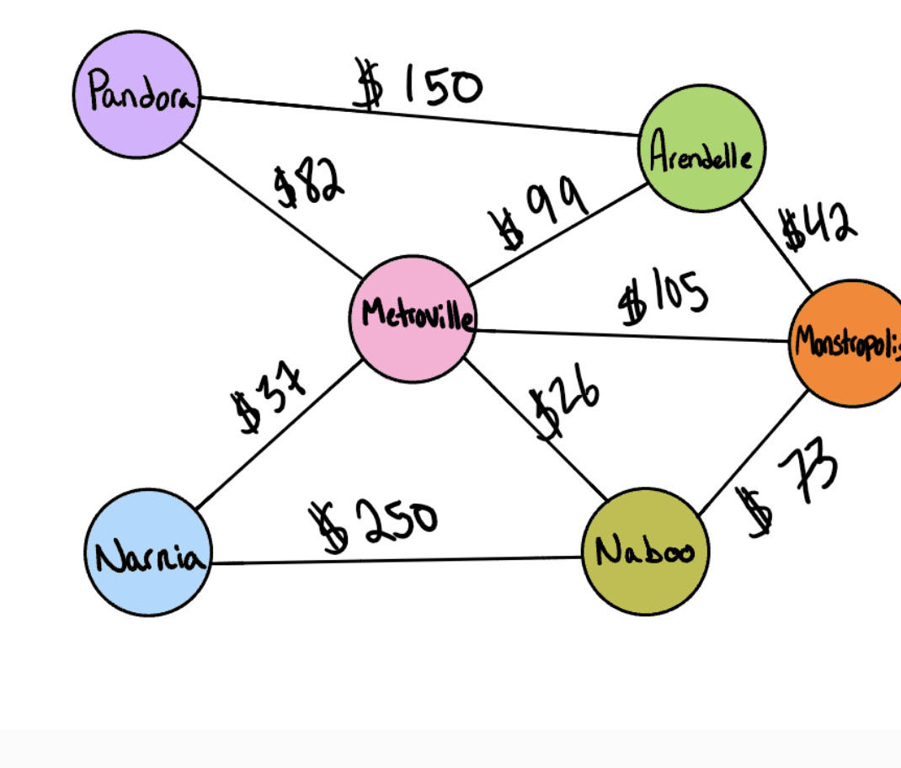

# Graph business trip

## Problem Domain
- Given a business trip itinerary, and an Alaska Airlines route map, is the trip possible with direct flights? If so, how much will the total trip cost be?

## Inputs/Outputs
input: graph, array of city names
return: cost or null

input: [Metroville, Pandora, ]
return: True, $82

input: [Arendelle, New Monstropolis, Naboo]
return: True, $115

input: [Naboo, Pandora]
return: False, $0

input: [Narnia, Arendelle, Naboo]
return: False, $0

## UML

## Efficiency
- Time complexity: O(V) Space complexity: O(V^2) where V is the number of vertices