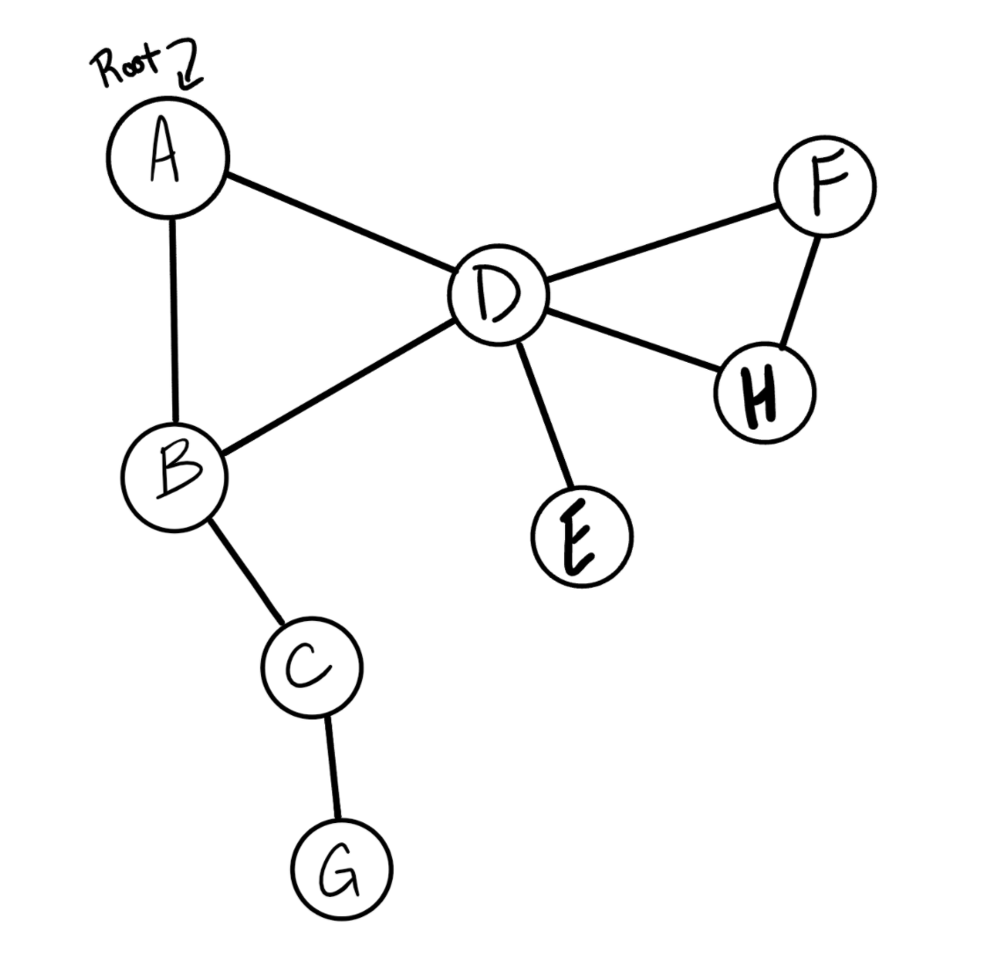

# Graph Depth First Traversal

## Problem Domain
- Conduct a depth first preorder traversal on a graph
- Write the following method for the Graph class:
- Name: Depth first
- Arguments: Node (Starting point of search)
- Return: A collection of nodes in their pre-order depth-first traversal order
- Program output: Display the collection

## Input/Output

Output - [A, B, C, G, D, E, H, F]

## Efficiency
- Time: O(|Vertices|+|Edges|) 
- Space: O(Vertices)
