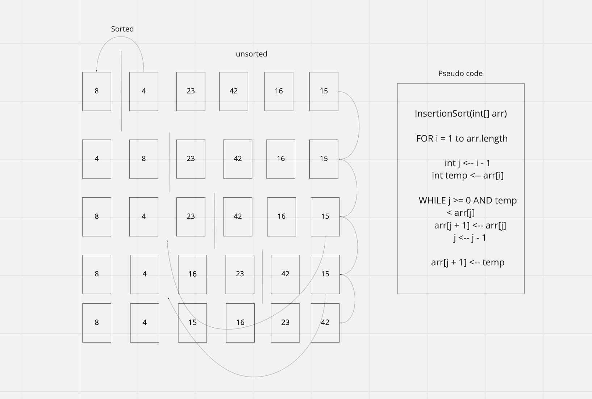

# Insertion Sort

## Challenge
- Review the pseudocode below, then trace the algorithm by stepping through the process with the provided sample array. Document your explanation by creating a blog article that shows the step-by-step output after each iteration through some sort of visual.
- Once you are done with your article, code a working, tested implementation of Insertion Sort based on the pseudocode provided.

## Algorithm
- Using the method `insertionSort()` make two arrays by splitting the given array at the index
- The loop will check to see if the trailing number is less than the current number, if less, the values will then swap but if not, it will remain in its position in the array.
- The loop will continue to do this till all of the values are in order from lowest to highest.

## UML 

