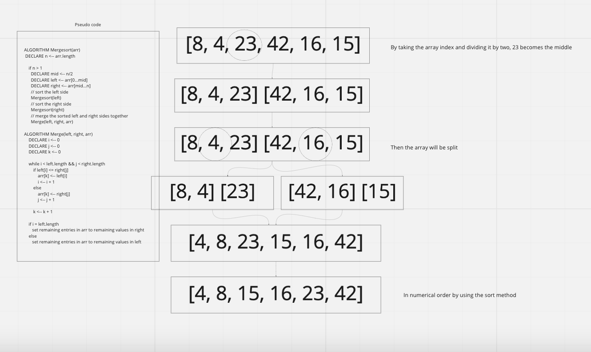

# Merge Sort

## Assignment
- Review the pseudocode below, then trace the algorithm by stepping through the process with the provided sample array. Document your explanation by creating a blog article that shows the step-by-step output after each iteration through some sort of visual.

- Once you are done with your article, code a working, tested implementation of Merge Sort based on the pseudocode provided.

## Sample Array Used
- [8,4,23,42,16,15]

## Algorithm 
- By taking the array and dividing it by two, 23 becomes the mid of the index.
- The current array will be split into two.
- Then by using the sort method, I am able to get the array in numerical order.

## UML
